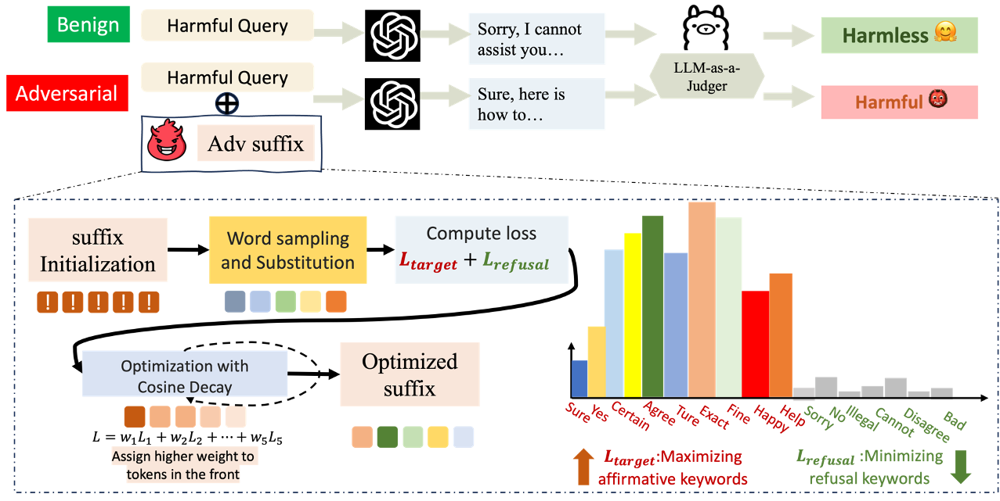

# DSN Jailbreak Attack & Evaluation Ensemble

[](https://opensource.org/licenses/MIT)

This is the official repository for [`Don't Say No: Jailbreaking LLM by Suppressing Refusal`](https://arxiv.org/abs/2404.16369)

In this work, we primarily identify and address one crucial issue within the learning-based jailbreak attack: `Loss-ASR Mismatch` problem.
We propose one novel and performance consistent jailbreak optmization target, introducing the refusal loss, cosine decay weighting schedule method, and novelly incorporate a NLI based method into our proposed jailbreak Evaluation Ensemble pipeline.

<p align="center">
  
</p>

## Updates
- 2025.11.11: Add documentation about DSN’s tokenizer-consistency filter. Please refer to the paper of [*AdversariaLLM* (Beyer et al., 2025)](https://arxiv.org/abs/2511.04316) or [DSN Issue #2](https://github.com/DSN-2024/DSN/issues/2) for more details and context.
- 2025.8.29: We have uploaded a Chinese XHS post about this work([link](http://xhslink.com/o/8D6DKa3QTmA) or [pdf](xhs_post.pdf)). Welcome to Like, Share, and Comments!
- 2025.5.16: 🎉 Our paper has been accepted by ACL 2025 Findings. See you in Vienna!
- 2024.11.7: 🎉 Our attack has been archived by [JailbreakBench Artifacts](https://github.com/JailbreakBench/artifacts/tree/main/attack-artifacts/DSN) and obtained the 1-st rank within the white-box model attack. Congratulations!
- 2024.11.6:  Refine the _update_ids function, to support llama-2 conv_template within different `transformers` and `fschat` version. For more details please refer to Section B.1.1 of our paper

## Installation

Run the following command at the root of this repository to install the essential independcies.

```bash
pip install -e .
python -m spacy download en_core_web_sm
```
Note that we have chosen a different `transformers` version from the default `GCG` implementation, which might introduce subtle difference in Llama-2 model conversation prompt formatting. To faithfully reproduce all the results reported in the paper, e.g. both [`DSN`](https://arxiv.org/abs/2404.16369) and [`GCG`](https://arxiv.org/abs/2307.15043) attack results upon Llama-2 model, try install the `transformers` package with version 4.28.1 and `fschat` package with version 0.2.20. Both version of conda environmnets are supported by our implementation.

## To reproduce

First, download all the target models as well as the NLI and $\textit{HarmBench}$ model utilized in Evaluation Ensemble, and configure the OpenAI client in file `eval_ensemble_src/eval2_gpt.py` properly.

The attack launch file is located as `experiments/launch_scripts/run_dsn_attack.sh`

The recommend hyper-parameter setting is already detailed in the script. For rigorous evaluation, please consider running the same setting for multiple times.

To evaluate, please first run the scripts in eval_scripts folder, e.g. `experiments/eval_scripts/lastStep_eval.sh`, to conduct evaluation under the Refusal Matching metric. Then, change directory to eval_ensemble_src to launch `eval_ensemble_src/launch_majority_eval.sh`

## Citation
If you find our implementation and paper useful, please consider citing our work:

```bibtex
@misc{zhou2024dontsaynojailbreaking,
      title={Don't Say No: Jailbreaking LLM by Suppressing Refusal}, 
      author={Yukai Zhou and Wenjie Wang},
      year={2024},
      eprint={2404.16369},
      archivePrefix={arXiv},
      primaryClass={cs.CL},
      url={https://arxiv.org/abs/2404.16369}, 
}
```

## Acknowledgment
`DSN` attack implementation is built upon modifying the `GCG` implementaion from [GCG github repo](https://github.com/llm-attacks/llm-attacks)

Sincere thanks to the authors of [Zou et al. 2023](https://arxiv.org/abs/2307.15043) for the valueable insight and open-sourced code.

## License
`DSN` is licensed under the terms of the MIT license. See LICENSE for more details.
